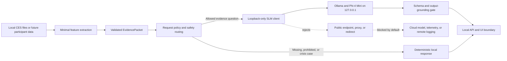
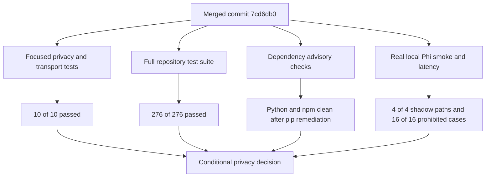

# MindSense Week 5 Privacy and Security Verification Report

Owner: Yuktha Naveen, Privacy and Security Lead

Verification date: 2026-09-05 (Australia/Sydney)

Reviewed merged commit: `7cd6db0`

Working branch: `yuktha/privacy-week5`
Decision: **Approved with mitigation for synthetic local development only**

## Purpose and scope

Week 4 established MindSense's written local-first privacy principles, network-egress test policy, dependency PR gate, and first real-machine Phi-4 Mini latency baseline. Week 5 verifies those controls against the merged SLM implementation. This review covers application network calls, telemetry, logs, data minimisation, dependency changes, vulnerability results, safety routing, local-model transport, and repeat latency on the same Mac.

This is not participant-use approval. The verification used source inspection, dependency manifests, synthetic fixtures, automated tests, local Ollama inference, advisory tools, and a point-in-time connection snapshot. It was not a packet capture, whole-device Wi-Fi-off test, penetration test, or clinical safety assessment.

## Implemented privacy architecture

The merged client in `backend/slm/client.py` accepts only HTTP loopback `/api/chat` endpoints. It validates the endpoint both when configuration is created and when a request is sent, disables environment proxies, and refuses HTTP redirects. Before the model receives an `EvidencePacket`, `participant_ref` is replaced with `redacted`. The original packet is not mutated.

The service still sends the user's question, evidence values, packet ID, feature ID, and other contract fields to the local model. These remain sensitive when linkable to a person. Callers must therefore provide non-identifying IDs and minimise free text; replacing one identifier is not general anonymisation.

## Network, telemetry, and logging review

| Area | Merged evidence | Assessment |
|---|---|---|
| Application network | The only backend HTTP client is `backend/slm/client.py`; its production default is `127.0.0.1:11434/api/chat`. | Pass |
| External endpoints | Tests reject a documentation-range public IP before opening a connection. | Pass |
| Proxies and redirects | Environment proxies are disabled and status codes 301, 302, 303, 307, and 308 are not followed. | Pass |
| Test-suite egress | `pytest.ini` blocks non-loopback Python sockets across the suite. | Pass |
| Runtime observation | Ollama and its model server were observed listening only on `127.0.0.1`; no established non-loopback Ollama connection appeared in the post-run snapshot. | Point-in-time pass |
| Telemetry | No analytics, telemetry, crash-upload, session-replay, or cloud-model SDK was detected in tracked application source or manifests. | Pass |
| Logs and output | The shadow CLI and latency benchmark can display or save model responses. They are approved only for synthetic development fixtures. | Mitigation required |

Ollama's official documentation says local inference does not send prompts or answers to Ollama, but model pulls require internet access and macOS/Windows installations can automatically download updates. Participant sessions must use pre-downloaded, pinned models, cloud features disabled, a loopback bind, and an externally blocked serving environment. No absolute claim that the binary can never communicate externally is made.

## Dependency and supply-chain verification

No tracked Python or npm dependency manifest changed between the Week 4 privacy baseline (`517ade3`) and reviewed merged commit `7cd6db0`. Week 5 retained standard-library `urllib` rather than adding an HTTP SDK. The PR template still requires a dependency privacy spot-check covering network behaviour, telemetry, downloads and updates, data access, licence, alternatives, and a review decision.

Checks performed on 5 September 2026:

- `pip check`: no broken requirements.
- `pip-audit -r requirements.txt`: no known vulnerabilities in the resolved declared set.
- Installed-environment `pip-audit`: initially identified advisories in development tool `pip 25.2`; local untracked `.venv` was upgraded to `pip 26.2`, after which the audit reported no known vulnerabilities.
- `npm audit`: zero known vulnerabilities across 70 locked frontend dependencies.
- Secret-pattern scan: no tracked Kaggle token, GitHub token, AWS access key, or private-key marker detected.
- Repository boundary: `dataset/`, `.venv/`, and `frontend/node_modules/` remain untracked, and no dataset or virtual-environment path appears in Git history.

The Python application requirements remain mostly unpinned and there is no resolved Python lockfile. A clean audit today therefore does not guarantee that a future installation will resolve the same versions.

## Automated verification results

| Verification | Result |
|---|---:|
| Focused network-egress and SLM transport suite | 10 passed |
| Complete pytest suite with local CES and frontend dependencies | 276 passed, 0 failed, 0 skipped |
| Relevant Ruff lint and formatting | Passed; 25 files already formatted |
| Frontend lint | Passed |
| Frontend TypeScript and Vite production build | Passed |
| Real Phi synthetic shadow smoke | 4/4 passed |
| Public prohibited-request baseline | 16/16 passed; 0 unexpected model calls |

The four-path smoke verified an eligible GPS explanation, deterministic missing-data response, diagnosis refusal, and crisis-aware response. The participant reference was absent from every displayed response. The 16-case baseline met the registered 100% high-severity threshold, but it is a public development subset, not the sealed Week 11 evaluation or proof of broad paraphrase coverage.

## Week 4 latency confirmation

The existing `benchmarks/slm_latency_results.json` was replaced with the Week 5 run, using the same five synthetic prompts, model tag, local Ollama provider, and loopback `/api/generate` endpoint.

| Metric | Week 4 | Week 5 | Change |
|---|---:|---:|---:|
| Minimum | 0.91 s | 1.26 s | +0.35 s |
| Mean | 2.22 s | 2.57 s | +0.35 s / +15.7% |
| Median | 2.34 s | 2.99 s | +0.64 s |
| Sample p95 | 3.28 s | 3.88 s | +0.60 s / +18.1% |
| Maximum | 3.46 s | 4.06 s | +0.60 s |

All five requests succeeded. The result confirms that Phi-4 Mini still runs locally on this Mac at prototype-scale latency, but the small sample does not establish a production service-level objective. The raw speed harness bypasses the integrated request-policy and output-grounding path, and some raw replies do not meet product wording requirements. Only responses returned through `SLMService` are eligible for display.

The model manifest records Phi-4 Mini as the baseline and Qwen3 4B as the challenger. Final model selection remains `comparison_pending`; this report does not change that team decision.

## Risks and required mitigations

| Risk or limitation | Required action before participant-facing use |
|---|---|
| No whole-device disconnected or packet-capture acceptance test was run. | Demonstrate the integrated app with public networking blocked and record process-scoped network evidence. |
| Ollama installation, model pulls, and app updates may access the internet. | Pre-install and pin the runtime/model; disable cloud features and external networking during sessions. |
| Only `participant_ref` is automatically redacted. | Use non-identifying contract IDs and minimise questions and evidence before the SLM boundary. |
| CLI and benchmark output can contain complete model text. | Restrict these tools to synthetic fixtures; define retention, consent, access, and redaction before real-user logging. |
| CES eligibility output still includes UID-level lists and reasons. | Replace shared output with aggregate reason counts before screenshots, demos, or shared logs. |
| Six frontend starter links open public sites when clicked. | Remove them or obtain explicit approval before participant-facing use. |
| Python requirements are mostly unpinned. | Add a resolved, reviewed Python lockfile and rerun the dependency privacy check. |
| Rule-based safety matching has limited paraphrase and language coverage. | Complete joint and held-out evaluation; do not present development checks as clinical validation. |

## Privacy decision

**Approved with mitigation for synthetic local development.** The merged Week 5 architecture materially improves the Week 4 position: the application SLM client now exists, is loopback constrained, blocks redirects and proxies, redacts the direct participant reference, and is covered by automated network and safety tests. Dependency and advisory checks are clean after remediating the local `pip` tool.

Participant-facing use remains unapproved until the disconnected integrated-app test, input-minimisation contract, logging and retention design, UID-output fix, external-link decision, reproducible Python lockfile, and required evaluation/governance reviews are complete.

## Repository evidence

- Architecture and policy: `privacy/privacy_architecture_principles.md`
- Week 5 dependency review: `docs/slm/week5-dependency-privacy-review.md`
- Local client: `backend/slm/client.py`
- Service safety path: `backend/slm/service.py`, `backend/slm/request_policy.py`, and `backend/slm/output_grounding.py`
- Network tests: `tests/privacy/test_no_network_egress.py` and `tests/slm/test_transport_privacy.py`
- PR rule: `.github/pull_request_template.md`
- Latency evidence: `benchmarks/slm_latency_benchmark.py` and `benchmarks/slm_latency_results.json`
- Safety evidence: `benchmarks/slm_shadow_smoke.py` and `benchmarks/slm_prohibited_request_baseline.py`

## References

1. Ollama, [FAQ: local data, cloud disablement, binding, model pulls, logs, and updates](https://docs.ollama.com/faq), accessed 5 September 2026.
2. Python Software Foundation, [`urllib.request` documentation](https://docs.python.org/3/library/urllib.request.html), accessed 5 September 2026.
3. OWASP Foundation, [Logging Cheat Sheet](https://cheatsheetseries.owasp.org/cheatsheets/Logging_Cheat_Sheet.html), accessed 5 September 2026.
